## 语法分析的主要任务
从词法分析器输出的token序列中识别出个类型的短语，并构造`语法分析树`

## 语法分析树（描述句子的语法结构）

::: tip 例
## 赋值语句分析树

```ts
   let       a      =     b     +    c          *    60;
// <LET> <IDN, a> <=> <IDN, b> <+> <IND, reta> <*> <NUM,60> <;>

// 在这里我将 种别码(kind) 用 k， 属性值（value）用 v 代指
tokens = [
  {k: "LET",  v: null, }, 
  {k: "IDN", v: 'a', },
  {k: "EQUAL" v: null, },
  {k: "IDN" v: 'b', },
  {k: "ADD" v: null, },
  {k: "IDN" v: 'c', },
  {k: "MULTIPLY" v: null, },
  {k: "NUM" v: 60, },
  {k: "SEMICOLON", v: null, },
] 
```
观察我们的语法，我们发现整个赋予值语句是由 `关键字, 标识符, 界线字符(=), 表达式, 界线字符(;)组成的`, 而`表达式`又由`标识符/变量, 运算符组成`

```mermaid
stateDiagram-v2
    赋值语句 --> 关键字（let）
    赋值语句 --> 标识符（a）
    赋值语句 --> 界线字符（=）
    赋值语句 --> 表达式1
    赋值语句 --> 界线符（;）

    表达式1 --> 标识符（b）
    表达式1 --> 运算符（+）
    表达式1 --> 表达式2

    表达式2 --> 标识符（c）
    表达式2 --> 运算符（*）
    表达式2 -->  数字（60）
```


我们可以将token序列成如下`语法树`

```ts
tree = [
  {k: "LET",  v: null, }, 
  {k: "IDN", v: 'a', },
  {k: "EQUAL", v: null, },
  {
    k: 'CHUNK',
    v: [
      {k: "IDN", v: 'b', },
      {k: "ADD", v: null, },
      {
        k: 'CHUNK',
        v: [
          {k: "IDN", v: 'c', },
          {k: "MULTIPLY", v: null, },
          {k: "NUM", v: 60, },
        ],
      }
    ],
  },
  {k: "SEMICOLON", v: null, },
] 
```
## 变量声明分析树
```ts
let a, b, c;
// <let> <ID, a> <,> <IDN,b> <,> <IND,c> <;>

// 在这里我将 种别码(kind) 用 k， 属性值（value）用 v 代指
tokens = [
  {k: "LET",  v: null, }, 
  {k: "IDN", v: 'a', },
  {k: "COMMA", v: null, },
  {k: "IDN", v: 'b', },
  {k: "COMMA", v: null, },
  {k: "IDN", v: 'c', },
  {k: "MULTIPLY", v: null, },
  {k: "NUM", v: 60, },
  {k: "SEMICOLON", v: null, },
] 
```
在这里整个语句由 `关键字, 标识符, 界线字符(,), 标识符, 界线字符(,), 标识符, 界线字符(;)组成`，我们可以把 `标识符, 界线字符(,), 标识符` 这种组合定义为一个`标识符组(IDNS)`

```mermaid
stateDiagram-v2
    变量声明 --> 关键字'let'
    变量声明 --> 标识符组1
    变量声明 --> 界线符（;）

    标识符组1 --> 标识符组2
    标识符组1 --> 界线符（,）1
    标识符组1 --> 标识符（c）

    标识符组2 --> 标识符（a）
    标识符组2 --> 界线符（,）2
    标识符组2 --> 标识符（b）
```



我们可以将token序列成如下`语法树`

```ts
tree = [
  {k: "LET",  v: null}, 
  {
    k: "IDNS", 
    v: [
      {
        k: "IDNS", 
        v: [
          {k: "IDN", v: 'a', },
          {k: "COMMA", v: null, },
          {k: "IDN", v: 'b', },
        ],
      },
      {k: "COMMA", v: null, },
      {k: "IDN", v: 'c', },
    ],
  },
  {k: "SEMICOLON", v: null, }
]
```

:::