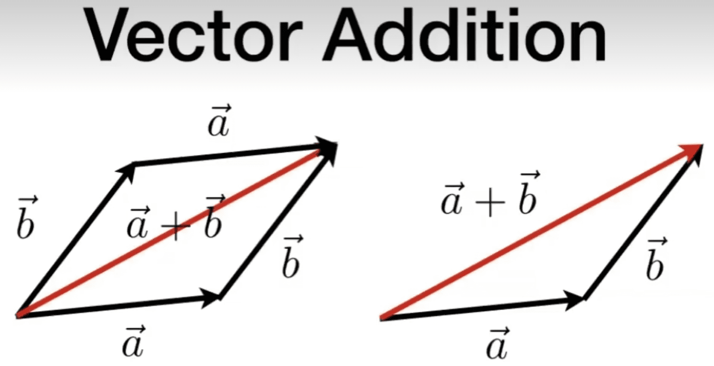

# 线性代数

# 向量
## 向量(vectors),是一个点指向另一个点的方向
$$
\vec{AB} = B - A
$$

### 任何表示的长度为1个单位的向量我们称为单位向量，等于向量/向量的长度
$$
\hat{AB} =  \vec{AB} \div ||\vec{AB}||
$$

### 将向量引入到坐标系中表示为
$$
\vec{a} =  \begin{pmatrix} x \\ y \\ \end{pmatrix}
\qquad
\vec{a}^T = \begin{pmatrix} x & y \\ \end{pmatrix}
\qquad
||\vec{a}|| = \sqrt{x^2+y^2}
$$

### 向量的乘法
- 向量的点乘
$$ \vec{a} . \vec{b} = ||\vec{a}||||\vec{b}||cos\theta $$
这可以帮助我们快速的确定两个向量之间的夹角$cos\theta$
$$ cos\theta = \hat{a}.\hat{b} $$
作用：
1. 当点乘结果逐渐趋向1时，我们可以知道这两个向量的方向越接近
2. 当点乘结果为0时，我们可以知道这两个向量的方向互相垂直
3. 当点乘结果逐渐趋向-1时，我们可以知道这两个向量的方向相反

它满足运算的交换率，与结合率
$$ \vec{a} . \vec{b} = \vec{b} . \vec{a} \qquad \vec{a} . (\vec{b}+\vec{c}) =\vec{a} . \vec{b} + \vec{a} . \vec{c} $$

- 向量的叉乘
$$ \vec{a} \times \vec{b} = ||\vec{a} \times \vec{b}|| = ||\vec{a}||||\vec{b}||sin\phi$$

在三维坐标系中(右手坐标系中)
$$ \vec{x} \times \vec{y} = +\vec{z} $$

叉乘没有交换率
$$ \vec{a} \times \vec{b} = -\vec{b} \times \vec{a} $$

作用:
1. 利用向量叉乘我们可以判断一个向量在另一个向量的左侧还是右侧
2. 可以判断一个点在一个多边形点内侧还是外侧

# 矩阵

### 矩阵的乘积
必须满足$(M \times N)(N \times P) = (M \times P)$

矩阵的乘积的结果中的单个目标等于矩阵A的行与矩阵B的列的元素分别相乘在并将元素相加
$$
  \begin{pmatrix}
  a1 & a2\\
  b1 & b2\\
  c1 & c2\\
  \end{pmatrix}
  \begin{pmatrix}
  A1 & A2\\
  B1 & B2\\
  \end{pmatrix}
  =
  \begin{pmatrix}
  a1 \times A1 + a2 \times B1 & a1 \times A2 + a2 \times B2\\ b1 \times A1 + b2 \times B1 & b1 \times A2 + b2 \times B2\\ c1 \times A1 + c2 \times B1 & c1 \times A2 + c2 \times B2\\ \end{pmatrix}
$$

只有对角线为1，其他元素为0对矩阵为单位矩阵
$$
  I_{3 \times 3}
  =
  \begin{pmatrix}
  1&0&0\\
  0&1&0\\
  0&0&1\\
  \end{pmatrix}
$$

## 向量的点乘
$$
  \vec{a}.\vec{b}
  =
  \vec{a}^T\vec{b}
  =
  \begin{pmatrix} x_a&y_a&z_a \end{pmatrix}
  \begin{pmatrix} x_b \\ y_b \\ z_b \end{pmatrix}
  =
  (x_ax_b+y_zy_b+z_az_b)
$$

## 向量的叉乘

$$
  \vec{a} \times \vec{b}
  =
  \begin{pmatrix}
  0 & -z_a & y_a \\
  z_a & 0 & -x_a \\
  -y_z & x_z & 0
  \end{pmatrix}
  \begin{pmatrix} x_b \\ y_b \\ z_b \end{pmatrix}
$$

### 矩阵的变换
- 缩放(scale)
$$
  SA
  =
  \begin{pmatrix}
  s_x & 0 & 0\\
  0 & s_y & 0 \\
  0 & 0 & s_z
  \end{pmatrix}
  \begin{pmatrix} x \\ y \\ z \end{pmatrix}
$$

- 切变(shear)
$$
  SA
  =
  \begin{pmatrix} 1 & s_y \\ s_x & 1 \end{pmatrix}
  \begin{pmatrix} x \\ y  \end{pmatrix}
$$

- 旋转(Retition)
$$
  R_\theta
  =
  \begin{pmatrix} cos\theta & -sin\theta \\ sin\theta & cos\theta \end{pmatrix}
$$
$$
  R^-_\theta
  =
  \begin{pmatrix} cos\theta & sin\theta \\ -sin\theta & cos\theta \end{pmatrix}
$$

# 奇次坐标
在平移变换中我们无法使用线性变换的法制进行转换
$$
  TA =
  \begin{pmatrix}a & b \\ c & d \end{pmatrix}
  \begin{pmatrix}x \\ y \end{pmatrix}
  +
  \begin{pmatrix}t_x\\ t_y \end{pmatrix}
$$
这时我们添加一个坐标 w 用来将它同化为线性变换

$$
  TA =
  \begin{pmatrix}1 & 0 & t_x\\ 0 & 1 & t_y \\ 0 & 0 & 1\end{pmatrix}
  \begin{pmatrix}x \\ y \\ w\end{pmatrix}
  =
  \begin{pmatrix}x+xt_x\\ y+yt_y \\ w^2\end{pmatrix}
$$
当$w \neq 0$时这是点坐标
$$
P = \begin{pmatrix}x / w & y / w & 1 \end{pmatrix}
$$

当$w = 0$时这是向量
$$
V = \begin{pmatrix}x & y & 0 \end{pmatrix}
$$

## 奇次坐标在三维中的转换
$$
  \begin{pmatrix} x^\prime \\ y^\prime \\ z^\prime \\ w \end{pmatrix}
  =
  \begin{pmatrix}
  a & b & c & t_x \\
  d & e & f & t_y \\
  g & h & i & t_z \\
  0 & 0 & 0 & 1
  \end{pmatrix}
  .
  \begin{pmatrix} x \\ y \\ z \\ w \end{pmatrix}
$$

Scale

$$
  S(s_x,s_y,s_z)
  =
  \begin{pmatrix}
  s_x & 0 & 0 & 0 \\
  0 & s_y & 0 & 0 \\
  0 & 0 & s_z & 0 \\
  0 & 0 & 0 & 1
  \end{pmatrix}
$$

Translation
$$
  T(t_x,t_y,t_z)
  =
  \begin{pmatrix}
  1 & 0 & 0 & t_x \\
  0 & 1 & 0 & t_y \\
  0 & 0 & 1 & t_z \\
  0 & 0 & 0 & 1
  \end{pmatrix}
$$

Rotation

$$
  R_x(\theta)
  =
  \begin{pmatrix}
  1 & 0 & 0 & 0  \\
  0 & cos\theta & -sin\theta & 0 \\
  0 & sin\theta & cos\theta & 0 \\
  0 & 0 & 0 & 1
  \end{pmatrix}
$$
$$
  R_y(\theta)
  =
  \begin{pmatrix}
  cos\theta & 0 & sin\theta & 0 \\
  0 & 1 & 0 & 0 \\
  -sin\theta & 0 & cos\theta & 0 \\
  0 & 0 & 0 & 1
  \end{pmatrix}
$$
$$
  R_z(\theta)
  =
  \begin{pmatrix}
  cos\theta & -sin\theta & 0 & 0 \\
  sin\theta & cos\theta & 0 & 0 \\
  0 & 0 & 1 & 0\\
  0 & 0 & 0 & 1
  \end{pmatrix}
$$

## 罗德里格斯公式
$$
R(n,\alpha)=
cos(\alpha)I +
(1-cos(\alpha))nn^T +
sin(\alpha)N
$$
其中
$$
n = 旋转的轴向量（过原点）
\qquad
\alpha = 旋转的角度
$$
$$
n^T = n的转置
\qquad
N =
\begin{pmatrix}
  0 & -n_z & n_y \\
  n_z & 0 & -n_x \\
  -n_y & n_x & 0
\end{pmatrix}
\qquad
I = 单位矩阵
$$
