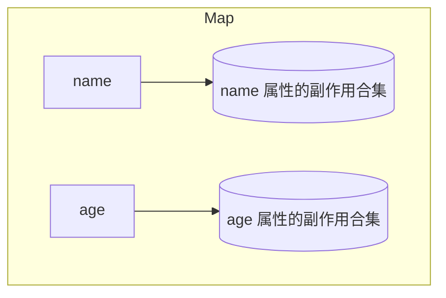
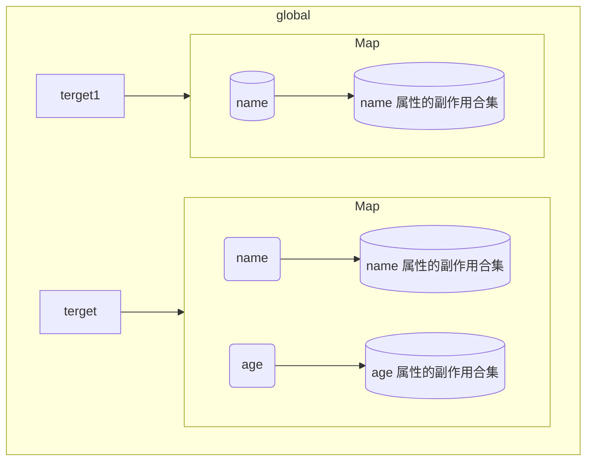

## 什么是响应式?
首先响应式是一个过程，由两个参与者组成，一个是`触发者`，另个是`响应者`

- 触发者：数据
- 响应者：引用数据的函数 (vue3中称之为`副作用函数(effect)`)

当数据改变时，引用数据的`副作用函数`响应数据的改变并重新执行，这个过程就是响应式


## 响应式核心：Proxy 代理
`new Proxy` 传入一个源对象，返回一个`Proxy`实例
```ts
//创建一个源对象
const srcObj = { name: 'srcObj'}

// 对srcObj进行代理
const prxoy = new Proxy(srcObj,{
  get(target, key){
    // 当访问proxy代理对象的属性时，会执行get函数
    // 将get函数的返回值作为表达式的值
    // target: 目标对象，key: 代理对象上的属性
    return target[key]
  }
  set(target, key, value){
    // 当设置proxy代理对象的属性时，会执行set函数
    // value: 新赋予的值
    return true
  }
})
```

## 基本的响应式实现思路
思路：先创建了一个代理对象，在对代理对象的值进行更改的时候重新执行副作用函数

创建 reactive 工厂函数
```ts
/**
 * 响应式数据工厂
 * @param target 源对象
 * @return object 代理对象
*/
function reactive<T extends object>(data: T):T{
  return new Proxy(data,{
    get(target, key){
      return target[key]
    },
    set(target,key,value){
      target[key] = value
      return true
    }
  })
}

// 定义一个响应式数据
const a = reactive({text: 'aaaa'})
```
定义一个`副作用函数`, 当函数被调用时更改 HTML 中的数据
```ts
function effect(){
  document.querySelector("#app").innerHTML =  a.text
}
```
在代理对象的属性被更改时调用`副作用函数`
```ts
function reactive<T extends object>(data: T):T{
  return new Proxy(data,{
    get(target, key){
      return target[key]
    },
    set(target,key,value){
      target[key] = value

      effect()

      return true
    }
  })
}
```
这样我们便实现了一个简单`reactive`函数

## 定义一个副作用桶

现在虽然我们已经实现了简单`reactive`函数，但`reactive`函数的拓展性还很低，如果我们有一个新的`副作用函数`也需要依赖与响应式数据时，我们只能通过硬编码的形式向`set`函数中插入这个`副作用函数`,这违反了`开闭原则`

既然如此我们定义一个`副作用函数集合`，在`set`函数中遍历这个集合并去执行集合中的`副作用函数`

```ts
// 定义一个副作用函数集合 用来收集副作用函数
const effectSet = new Set<Effect>()

function reactive<T extends object>(data: T):T{
  return new Proxy(data,{
    get(target, key){
      return target[key]
    },
    set(target,key,value){
      target[key] = value

      // 在更改值时调用副作用函数
      // effect()
      effectSet.forEach(effect=>{
        effect()
      })

      return true
    }
  })
}
```
当有新的`副作用函数`需要依赖于`reactive`时我们向`副作用函数集合`中添加这个`副作用函数`即可
```ts
// 定义一个副作用函数
function effectA(){
  document.querySelector("#app").innerHTML =  a.text
}
effectSet.add(effectA)

function effectB(){
  document.querySelector("#app-b").innerHTML =  a.text
}
effectSet.add(effectB)
```
在这里我们通常称这种`副作用函数集合`为`副作用桶(bucket)`

## 依赖收集
前面我们通过`副作用函数`放入到`副作用桶`中实现了对`副作用函数`的拓展，但这里我们没有区分不同属性对应的`副作用函数`，这会导致不必要的性能损失

比如:
``` ts
// 我们定义一个响应式数据，有name和age两个属性
const person = reactive({name: 'a', age: 0})

// 定义一个副作用函数用来渲染name
function effectName(){
  document.querySelector("#name").innerHTML =  person.name
}
effectSet.add(effectName)

// 再定义一个副作用函数用来渲染age
function effectAge(){
  document.querySelector("#age").innerHTML =  person.age
}
effectSet.add(effectAge)

/**
 * 在这里当我改变 person.name 的值时，effectName和effectAge都将被调用，
 * 这并不合理，因为我们只更改了person.name
 * 而 effectAge 这个副作用函数没有依赖与 name 实现，这里它不应该被执行
 * */
person.name = 'b'
```

问题：`副作用函数`与它所依赖的属性没有一一对应

解决思路：

1. 将当前`副作用函数`保存到一个全局变量中
2. 当执行`副作用函数`时会触发代理对象的`get函数`
3. 在`get函数`中我们将全局变量中保存的`副作用函数`收集到`副作用函桶`中

步骤1: 定义一个全集到变量，存放当前正在执行的`副作用函数`
```ts
let activeEffect:Effect|null = null
```
步骤2: 定义一个`副作用函数`，将`副作用函数`保存到`activeEffect`上
```js
// 定义一个副作用函数
function effectName(){
  document.querySelector("#name").innerHTML =  person.name
}

// 将 effect 存放到 activeEffect 中
activeEffect = effectName
// 执行effect, 这时它会去获取person的name属性，这会触发代理对象的get函数
effectName()
// activeEffect重空，等待下一个副作用函数的执行
activeEffect = null
```

步骤3: 我们回到`reactive`工厂函数中，在`get`函数中将`activeEffect`上保存的`副作用函数`放到`副作用桶`里

```ts
function reactive<T extends object>(data: T):T{
  return new Proxy(data,{
    get(target, key){
      // 如果全局中的 activeEffect 不为空就把 activeEffect 放到桶中
      if(activeEffect!==null){
        effectSet.add(activeEffect)
      }
      return target[key]
    },
    set(target,key,value){
      ...
    }
  })
}
```
这样当我们执行`步骤2`时，代理对象会自动的将我们的`副作用函数`收集到`副作用桶`中，为了方便后面调用，我们将 `步骤2` 封装成为一个方法
```ts
/**
 * 注册副作用函数
 * @param [function] 需要注册的副作用函数
*/
function registEffect(effect:Effect){
  if(typeof effect !== 'function') return
  // 将 effect 存放到 activeEffect 中
  activeEffect = effectName
  // 执行effect, 这时它会去获取person的name属性，这会触发代理对象的get函数
  effectName()
  // activeEffect重空，等待下一个副作用函数的执行
  activeEffect = null
}

// 定义一个副作用函数
function effectName(){
  document.querySelector("#name").innerHTML =  person.name
}
// 注册 effectName
registEffect(effectName)
```
::: info 在 vue源码中将 registEffect 写为 effect
:::

现在我们实现了对`副作用函数`的注册，但我们的问题还没有解决，`副作用函数`与它所依赖的属性还是没有一一对应，但是我们距离实现已经很接近了，我们只需要对我们的桶进行`Map映射`


首先我们修改一下桶的结构
```ts
// const effectSet = new Set<Effect>()
type EffectSet = Set<Effect>
const effectMap = new Map<string|symbol,EffectSet>()
```
在`reactive`工厂函数中我们修改`get`和`set`函数
```ts
function reactive<T extends object>(data: T):T{
  return new Proxy(data,{
    get(target, key){
      if(activeEffect!==null){
        let depSet:Set<Effect>

        // 判断 Map 中是否有当前属性的副作用合集
        let depSet: EffectSet = effectMap.get(key)
        if(!depSet) {
          // 如果不存在就新建一个 EffectSet 并添加到 Map 里
          depSet = new Set()
          depMap.set(key,depSet)
        }

        // 将副作用函数添加到合集里
        depSet.add(activeEffect)
      }
      return target[key]
    },
    set(target,key,value){
      target[key] = value
      // 获取副作用合集,如果没就直接返回
      const depSet = effectMap.get(key)
      if(!depSet) return true
      // 遍历副作用桶并调用其中的副作用方法
      effectSet.forEach(effect=>{
        effect()
      })
      return true
    }
  })
}
```
::: info vue源码中对 get/set 函数中关于依赖收集的部分进行了封装，分别为 track/trigger 方法
:::

## 进一步改进桶结构
到这里我们基本完成了响应式的基本逻辑，但如果我们将视角拉回全局你会发现，如果我们定义两个响应式对象，且两个响应式对象都有一个属性名相同的属性，我们一样会遇见我们在`依赖收集`中遇到的问题

如果你认真的看完了`依赖收集`你一定会想到，在这里我们只需要将桶进一步改造一下，将不同的响应式对象分割成不同的`副作用桶`




## 使用 WeckMap 对桶结构进行改进
::: tip WeckMap 弱映射表
  可以看成是Map的弱版本，它的key只能是一个对象，具体区别可以去看[这篇文章](/note/es6/Map-WeakMap.html)
:::

```ts
// const effectMap = new Map<string|symbol,EffectSet>()
type EffectSet = Set<Effect>
type EffectMap = Map<string|symbol,EffectSet>
const bucket = new WeakMap<object,EffectMap>()
```
改写 reactive
```ts
function reactive<T extends object>(data: T):T{
  return new Proxy(data,{
    get(target, key){
      if(activeEffect===null){

        // 判断bucket桶中是否有当前target的副作用Map
        let depMap: EffectMap = bucket.get(target)
        if(!depMap) {
          // 如果不存在就新建一个 EffectMap 并添加到桶中
          depMap = new Map()
          bucket.set(target,depMap)
        }

        // 判断 Map 中是否有当前属性的副作用合集
        let depSet: EffectSet = depMap.get(key)
        if(!depSet) {
          // 如果不存在就新建一个 EffectSet 并添加到 Map里
          depSet = new Set()
          depMap.set(key,depSet)
        }

        // 将副作用函数添加到合集里
        depSet.add(activeEffect)
      }
      return target[key]
    },
    set(target,key,value){
      target[key] = value

      // 获取副作用Map,如果没就直接返回
      const depMap = bucket.get(target)
      if(!depMap) return true

      // 获取副作用合集,如果没就直接返回
      const depSet = depMap.get(key)
      if(!depSet) return true

      depSet.forEach(effect=>{
        effect()
      })
      return true
    }
  })
}
```

## 总结
现在我们通过`reactive`函数创建响应式对象，并使用`registEffect`函数对副作用函数进行依赖搜集，当响应式数据发生改变时会触发`set`函数找到对应的副作用函数并执行
这实际上是一个发布订阅模式，响应式数据作为发布者，副作用函数作为订阅者

完整代码：
```ts
type Effect =()=>void

// 定义一个副作用函数集合 用来收集副作用函数
type EffectSet = Set<Effect>
type EffectMap = Map<string|symbol,EffectSet>
const bucket = new WeakMap<object,EffectMap>()


// 定义一个全局变量用来存放即将被放入到桶中的副作用函数
let activeEffect:Effect|null = null

/**
 * 注册副作用函数方法
 * @param [function] 需要被注册的副作用方法
*/
function registEffect(effect:Effect){
  // 将 effect 存放到 activeEffect 中
  activeEffect = effect
  // 执行effect, 这时它会去获取person的name属性，这会触发代理对象的get函数
  effect()
  // activeEffect制空，等待下一个副作用函数
  activeEffect = null
}

/**
 * 创建一个响应式数据
 * @param target 源对象
 * @return object 代理对象
*/
function reactive<T extends object>(data: T):T{
  return new Proxy(data,{
    get(target, key){
      if(activeEffect===null){

        // 判断bucket桶中是否有当前target的副作用Map
        let depMap: EffectMap = bucket.get(target)
        if(!depMap) {
          // 如果不存在就新建一个 EffectMap 并添加到桶中
          depMap = new Map()
          bucket.set(target,depMap)
        }

        // 判断 Map 中是否有当前属性的副作用合集
        let depSet: EffectSet = depMap.get(key)
        if(!depSet) {
          // 如果不存在就新建一个 EffectSet 并添加到 Map里
          depSet = new Set()
          depMap.set(key,depSet)
        }

        // 将副作用函数添加到合集里
        depSet.add(activeEffect)
      }
      return target[key]
    },
    set(target,key,value){
      target[key] = value
      // 在更改值时调用副作用函数
      const depMap = bucket.get(target)
      if(!depMap) return true
      const depSet = depMap.get(key)
      if(!depSet) return true
      depSet.forEach(effect=>{
        effect()
      })
      return true
    }
  })
}
```

::: info
这篇文章是对`b站 杰哥课堂`发布的[Vue3.2源码设计与实现-响应式原理](https://www.bilibili.com/video/BV17G41157E6?p=1&vd_source=21bbf6e01e2a4b35d0464ec96193938c)的学习总结，强烈推荐去看一看，真的非常棒！如果你也这样觉得的话，请不要忘记给个三连！
我给了！真的(下次一定！)！！！
:::
