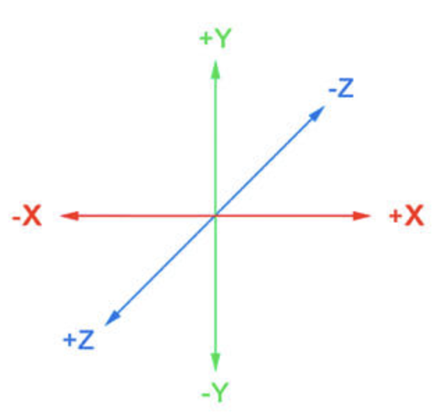
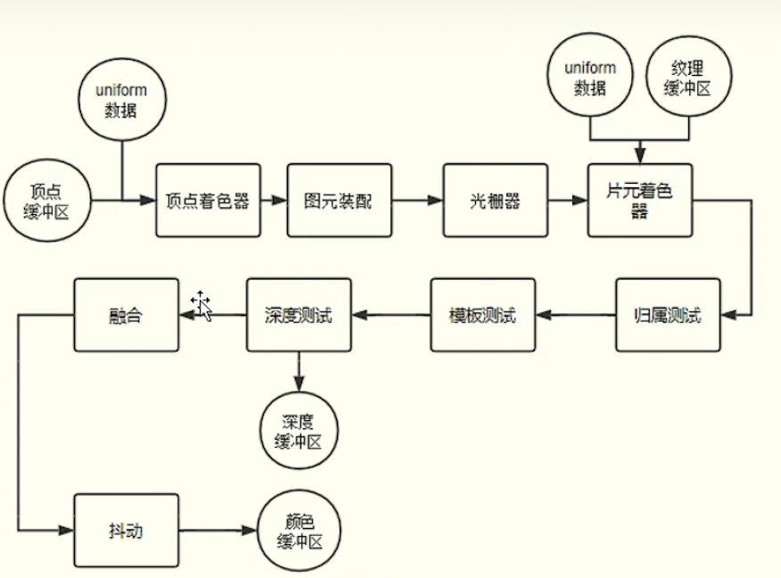

## WebLG 容器
在浏览器使用 canvas 作为 weblg 容器

```html
<canvas  id="canvas"> </canvas>
```

在声明canvas上下文对象时使用 weblg 作为 contextId

``` ts
const ctx = document.querySelector<HTMLCanvasElement>("#canvas")?.getContext("webgl");
```


## 坐标系与绘制区间

::: tip webgl使用的是正交右手坐标系 切每一个方向可使用的值的区间为0到1 超出该区间的图像不会绘制
  x最左边为-1,最右边为1;  
  y轴最下边为-1，最上边为1;  
  z轴朝向你的方向最大值为1，远离你的方向最大值为-1;  
:::

::: info 注：这些值与Canvas的尺寸无关，无论Canvas的长宽比是多少，WebGl的区间值都是一致的。  
:::




## WebGL 渲染管线
渲染管线就像一条流水线，由一系列具有特定功能的数宇电路单元组成，下一个功能单元处理上一个功能单元生成的数据，逐级处理数据。  
顶点着色器和片元着色器是可编程的功能单元，拥有更大的自主性，还有光栅器、深度测试等不可编程的功能单元。CPU会通过WebGL APl和GPU通信，传递着色器程序和数据，GPU执行的着色器程序可以通过useProgram方法切换，传递数据就是把CPU主存中的数据传送到GPU的显存中。


