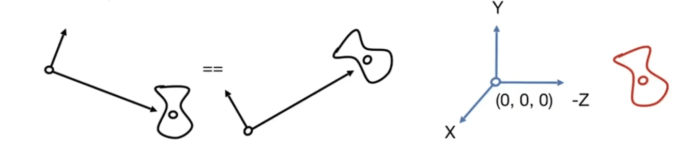
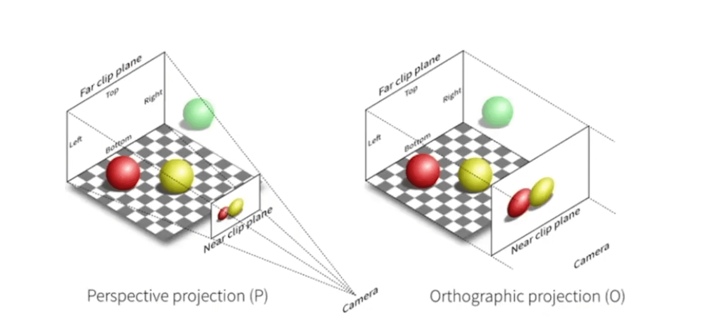
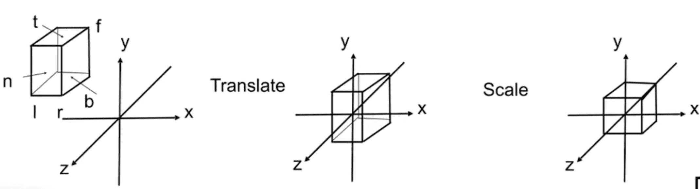
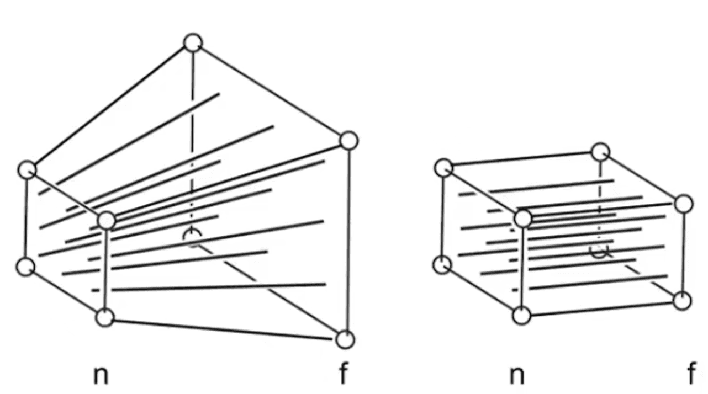
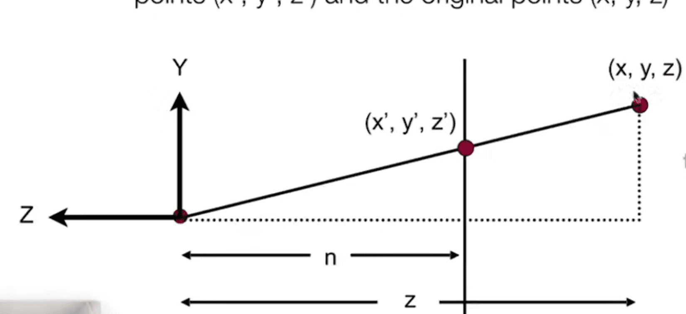

# 观测变换
::: info 提问：在现实生活中我们如何将一个三维的世界变成一个二维的平面
1. 我们在三维世界中准备好一些模型(模型变换 model transformation)
2. 我们架设好我们的相机(视图变换 view transformation)
3. 我们将模型投影到我们的相机上(投影变换 projection transformation)
在计算机图形学中将这三步简称为MVG

:::

## 视图/摄像机变换 view / Camera transformation
- 定义该 veiw 的位置$\vec{e}$
- 定义向什么地方看$\hat{g}$（look-at/gaze direction） 
- 定义一个向上的方向$\hat{t}$ 

在计算机图形学中我们通常将`view`的位置$\vec{e}$ 放在原点，将`view`的朝向$\hat{g}$ 与 `-Z` 重合，将视图的上方向$\hat{t}$ 与 `Y` 重合

- 将视图平移到原点
$$
T_{view} 
=
\begin{pmatrix} 
0 & 0 & 0 & -X_e\\
0 & 0 & 0 & -Y_e  \\
0 & 0 & 0 & -Z_e\\ 
0 & 0 & 0 & 1\\
\end{pmatrix} 
$$

- 旋转到 $\hat{g}$，$\hat{t}$ 与`-Z`,`Y`重合并不是很方便计算，但我们可以先反过来求`-Z`,`Y` 与 $\hat{g}$，$\hat{t}$重合
$$
R^-_{view} 
= 
\begin{pmatrix} 
x_{g \times t} & x_{t} & x_{-g} & 0 \\
y_{g \times t} & y_{t} & y_{-g} & 0 \\
z_{g \times t} & z_{t} & z_{-g} & 0\\
0 & 0 & 0 & 1\\
\end{pmatrix}
$$

- 我们再求逆就可以获得旋转后的视图矩阵，且因为旋转矩阵为正交矩阵，正交矩阵的逆等于它的转置  
$$
R_{view}
= 
\begin{pmatrix} 
x_{g \times t} & y_{g \times t} & z_{g \times t} & 0\\
x_{t} & y_{t} & z_{t} & 0  \\
x_{-g} & y_{-g} & z_{-g} & 0\\ 
0 & 0 & 0 & 1\\
\end{pmatrix}
$$
  ::: tip 正交于正交矩阵
  #### 正交 
  正交是指两个向量之间的夹角为 90 度，即它们垂直且不相关。两个正交向量之积为 0，也就是说它们没有共同的方向，因此可以相互抵消。正交性对分析几何中的物理性质非常重要，例如在力学和电磁学中，它们可以用来表示不同的力或不同的电磁场。

  #### 正交矩阵
  正交矩阵是一种特殊的矩阵，它具有以下特性：它的列向量之间相互正交、它的行向量之间相互正交，而且它的转置也是它自己（即 $A^T = A$）
  :::

我们先进行平移变换$T_{view}$然后在进行旋转变换$R_{view}$就可以得到视图变换$M_{view}$
$$
  M_{view} = R_{view}T_{view}
$$

## 投影变换 projection transformation 
::: tip 投影分为

:::

### 正交投影 Orthographic projection
我们先定义一个立方体，用$[l,r]$表示左和右，用$[t,b]$表示上和下，用$[f,n]$表示远和近，然后我们将这个立方体先平移到中心与原点对齐，再将他们的宽度都缩放成各方向长度都为2的标准矩阵

::: info 因为我们是从 -Z 往里看的，所以这里的n实际上是大于f的 
::: 

$$
M_{ortho}
=
\begin{bmatrix}
  \frac{2}{r-l} & 0 & 0 & 0 \\
  0 & \frac{2}{t-b} & 0 & 0 \\
  0 & 0 & \frac{2}{n-f} & 0 \\
  0 & 0 & 0 & 1 \\
\end{bmatrix}
\begin{bmatrix}
  1 & 0 & 0 &  -\frac{r+l}{2}\\
  0 & 1 & 0 &  -\frac{t+b}{2}\\ 
  0 & 0 & 1 &  -\frac{n+f}{2}\\
  0 & 0 & 0 & 1 \\
\end{bmatrix}
$$

### 透视投影 Perspective projection 
在透视投影中，我们可以将它简单的分为两步
- 我们先将投影的远平面$f$挤压到与近平面$n$的长宽都有一样
- 然后我们在做一次正交投影就好了

#### 挤压远平面$f$
我们先观察其中当个向量的变化

不难发现这实际上是一个相识三角形，从中我们可以得出
$$
y^{\prime} = \frac{n}{z} y
$$
同理
$$
x^{\prime} = \frac{n}{z} x
$$
::: tip 在奇次坐标中
$$
\begin{pmatrix}
  x & y & z & 1
\end{pmatrix}
=
\begin{pmatrix}
  kx & ky & kz & k \neq	0
\end{pmatrix}
=
\begin{pmatrix}
  zx & zy & z^2 & z \neq	0
\end{pmatrix}
$$
它们表示的都是空间中的同一个点  
:::
$$
\begin{pmatrix}
  x \\ y \\ z \\ 1
\end{pmatrix}
=>
\begin{pmatrix}
  nx/z \\ ny/z \\ unknown \\ 1
\end{pmatrix}
==
\begin{pmatrix}
  nx \\ ny \\ still \ unknown \\ z
\end{pmatrix}
$$
这样我们可以得出压缩矩形的前两行
$$
M_{p->o} = 
\begin{pmatrix}
n & 0 & 0 & 0 \\
0 & n & 0 & 0 \\
? & ? & ? & ? \\
0 & 0 & 1 & 0
\end{pmatrix}
$$
::: tip 现在我们只剩下$z$列没有求出来，我们再观察压缩模型

- 在近平面$n$的任何一个点的$\begin{pmatrix}x & y & z\end{pmatrix}$都不会发生变化
- 在远平面$f$的任何一个点的$z$也不会发生变化
:::

所以在近平面$n$中,我们可以却定`z`行的前两列为0,切它经过矩阵之后永远等于它自己

$$

\begin{pmatrix}
x \\ y \\ n \\ 1
\end{pmatrix}
=>
\begin{pmatrix}
x \\ y \\ n \\ 1
\end{pmatrix}
==
\begin{pmatrix}
xn \\ yn \\ n^2 \\ n
\end{pmatrix}
\qquad
\begin{pmatrix}
0 & 0 & A & B
\end{pmatrix}
\begin{pmatrix}
x \\ y \\ n \\ 1
\end{pmatrix}
= n^2
$$
即
$$
An + B = n^2
$$
在远屏幕$f$上
$$
\begin{pmatrix}
0 \\ 0 \\ f \\ 1
\end{pmatrix}
=>
\begin{pmatrix}
0 \\ 0 \\ f \\ 1
\end{pmatrix}
==
\begin{pmatrix}
0 \\ 0 \\ f^2 \\ f
\end{pmatrix} 
\qquad
Af + B = f^2
$$
将以上两个方程组成方程组
$$
\left\{ 
    \begin{array}{c}
        An + B = n^2 \\ 
        Af + B = f^2\\ 
    \end{array}
\right. 
得出:
\left\{ 
    \begin{array}{c}
        A = n + f \\ 
        B = -fn \\ 
    \end{array}
\right. 
$$
这里我们就补全了我们的压缩矩阵
$$
M_{p->o} = 
\begin{pmatrix}
n & 0 & 0 & 0 \\
0 & n & 0 & 0 \\
0 & 0 & n+f & -fn \\
0 & 0 & 1 & 0
\end{pmatrix}
$$

- 在近平面$n$的任何一个点的$\begin{pmatrix}x & y & z\end{pmatrix}$都不会发生变化
- 在远平面$f$的任何一个点的$z$也不会发生变化

现在我们只要将压缩后的视图进行正交投影就得到了我们的透视投影的矩阵
$$
M_{presp}=M_{ortho}M_{p->o}
$$

::: tip 疑问?: 当$n$$f$中间的任意一个平面被压缩时它的`z`是远离我们的近平面还是靠近？

我们带入一个特殊的平面$\frac{n+f}{2}$

$$
\begin{pmatrix}
x & y & \frac{n+f}{2} \ 1
\end{pmatrix}
\begin{pmatrix}
0 \\ 0 \\ \ n + f \\ -fn
\end{pmatrix}
= \frac{(n+f)^2}{2} - fn
= \frac{n^2 +f^2}{2}

$$
因为:
$$
\frac{n^2 +f^2}{2} > 0
$$
所$z^{\prime}$一定是远离$z$的

:::