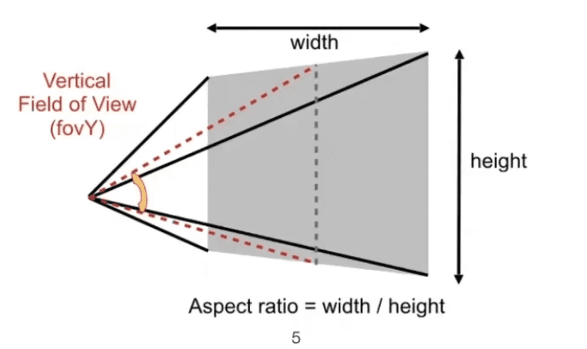
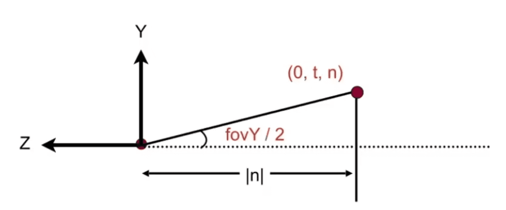
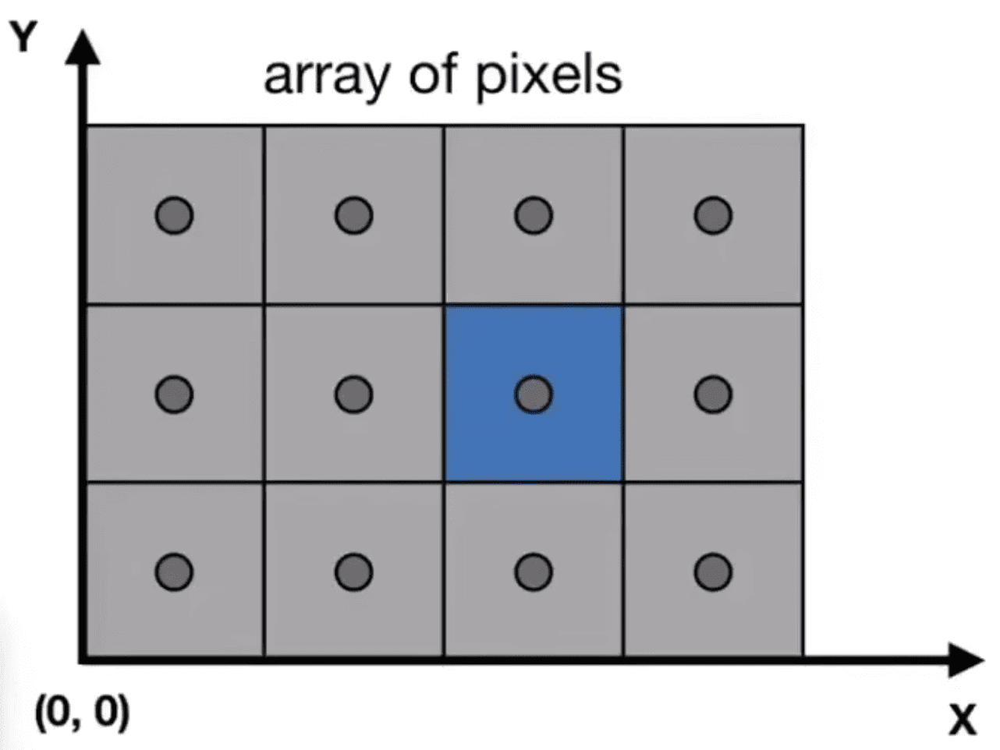

# 视口的定义（viewport）
## 屏幕空间
在计算机图像学中使用视角field-of-veiw(fovY)和长宽(aspect ratio)比来定义视口



在知道视角fovY之后我们可以得到屏幕在竖直方向上的半径$t$



$$
t = tan\frac{fovY}{2} * |n|
$$

视口的上下分别为
$$
  viewT=t\qquad viewB=-t
$$

视口的水平方向上的半径$r$可以利用长宽比得到
$$
r = aspect*t\qquad viewR= r \qquad viewL = -r
$$

# 光栅化
::: tip 光栅化就是将模型映射到平面上的过程
:::

## 像素与屏幕空间
屏幕的最小单位为像素，每个像素由三元色(rgb)和明亮程度组成


::: info 在有些图像api中将坐标系的原点定在屏幕的左上角并反转y轴的方向 
:::

- 像素的坐标为$\begin{pmatrix}x,y\end{pmatrix}$
- 像素取值范围为$\begin{pmatrix}0,0\end{pmatrix}->\begin{pmatrix}width-1,height-1\end{pmatrix}$
- 像素的中心为$\begin{pmatrix}x+0.5,y+0.5\end{pmatrix}$
- 屏幕的空间为$\begin{pmatrix}0,0\end{pmatrix}->\begin{pmatrix}width,height\end{pmatrix}$

## 映射到视口矩阵
在投影变换中我们将模型压缩成为了一个$\begin{bmatrix}-1,1\end{bmatrix}^3$的[标准矩阵](./viewing.md/#正交投影-orthographic-projection)，在这里我们暂时不对$z$轴进行处理，先将标准矩阵的$\begin{bmatrix}-1,1\end{bmatrix}^2$映射到$\begin{bmatrix}0,width\end{bmatrix} \times \begin{bmatrix}0,height\end{bmatrix}$上，并且将原点平移到屏幕的左下角
$$
Mviewport 
= 
\begin{pmatrix}
\frac{width}{2} & 0 & 0 & \frac{width}{2} \\
0 & \frac{height}{2} & 0 & \frac{height}{2} \\
0 & 0 & 1 & 0 \\
0 & 0 & 0 & 1 \\
\end{pmatrix}
$$

## 三角型: 图形学最基本的多边形
::: tip 性质:
1. 三角型色边最少的三角形
2. 任何其他不同的多边形都能被分割成三角形
3. 三角型的三个点一定是在同一个平面的   
:::

### 采样法判断屏幕上的一个点是否在三角形内
给定一个函数，去判断该函数内的x，y与三角形三个顶点间向量的叉积的方向是否一致，就可以求出改点，就可以得出该点是否在三角型的内部

::: info 这里的n代指三角形的顶点  
  $n>0$，$n<=3$，当 $n=3$ 时 $n+1=0$

:::
$$
p = \begin{pmatrix}
  x & y & z
\end{pmatrix}
\qquad
t = \begin{pmatrix}
  t^1 \\
  t^2 \\
  t^3 \\
\end{pmatrix}
\qquad
t^n = \begin{pmatrix}
  t_x^n & t_y^n & t_z^n
\end{pmatrix}
$$
求出三角形顶点到当前坐标之间的向量$v_p^n$与三角形顶点之间的向量$v_t^n$
$$
v_p^n = p - t^n = 
\begin{pmatrix}
  x - t_x^n \\ 
  y - t_y^n \\
  z - t_z^n
\end{pmatrix}
\qquad
v_t^n = t^{n+1} - t^n = \begin{pmatrix}
  t_x^{n+1} - t_x^n \\ 
  t_y^{n+1} - t_y^n \\
  t_z^{n+1} - t_z^n
\end{pmatrix}
$$
求出向量$v_t^n$与向量$v_p^n$的叉积
$$
c^n = v_t^n \times v_p^n = \begin{pmatrix}
  0 & -(t_z^{n+1} - t_z^n) & t_y^{n+1} - t_y^n \\
  t_y^{n+1} - t_y^n  & 0 & -(t_x^{n+1} - t_x^n) \\
  -(t_y^{n+1} - t_y^n) & t_x^{n+1} - t_x^n & 0
\end{pmatrix}
\begin{pmatrix}
  x - t_x^n \\ 
  y - t_y^n \\
  z - t_z^n
\end{pmatrix}
$$
计算$z$轴的值
$$
z_n = c_z^n = (t_x^{n+1} - t_x^n)(y - t_y^n) -(t_y^{n+1} - t_y^n)( x - t_x^n )
$$
::: tip 如果z轴的方向同为正或负则点在三角形内
```c++
(z0 > 0 && z1 > 0 && z2 > 0)||( z0 < 0 && z1 < 0 && z2 < 0);
```
在计算机图形学中我们通常以一个像素的中心点，去判断
:::

我们使用一个连续的函数去遍历屏幕上的每一个点，对点进行判断，如果在三角形内我们就将它改变颜色并渲染到屏幕上，这样我们就完成了一个基本的三角形的图形光栅化

### 包围盒优化光栅算法


## 反走样(抗锯齿)与深度缓冲